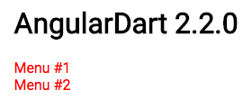

# Common source code
```dart
import 'package:angular2/platform/browser.dart';
import 'package:angular2/core.dart';

@Component(
  selector: 'my-app',
  template: '''
      <h1>AngularDart x.y.z</h1>
      <navbar></navbar>
      ''',
  directives: const [Navbar],
)
class AppComponent {}

@Component(
    selector: 'navbar',
    template: '''
        <div *ngFor="let content of contents">
          <navbar-tab [text]="content"></navbar-tab>
        </div>
        ''',
    styles: const [':host .tab-label-content a { color: red; }'],
    directives: const [NavbarTab])
class Navbar {
  Navbar();

  @Input()
  List<String> contents = ["Menu #1", "Menu #2"];
}

@Component(
    selector: 'navbar-tab',
    template: '''<a><span>{{text}}</span></a>''',
    host: const {"style": "display: block;", "class": "tab-label-content"})
class NavbarTab {
  @Input()
  String text;
}

void main() {
  bootstrap(AppComponent);
}
```

# Output
[Angular 2.2.0](https://sestegra.github.io/issue-angulardart/ng2/build/web/index.html)

```html
...
<style>[_nghost-vgl-2] .tab-label-content a { color: red; }</style>
...
<navbar _nghost-vgl-2="">
  <!--template bindings={}-->
  <div _ngcontent-vgl-2="">
    <navbar-tab _ngcontent-vgl-2="" class="tab-label-content" style="display: block;">
      <a><span>Menu #1</span></a>
    </navbar-tab>
  </div>
  <div _ngcontent-vgl-2="">
    <navbar-tab _ngcontent-vgl-2="" class="tab-label-content" style="display: block;">
      <a><span>Menu #2</span></a>
    </navbar-tab>
  </div>
</navbar>
...
```



[Angular 3.0.0](https://sestegra.github.io/issue-angulardart/ng3/build/web/index.html)

```html
...
<style>._nghost-qhq-2 .tab-label-content._ngcontent-qhq-2 a._ngcontent-qhq-2 { color:red; }</style>
...
<navbar class="_nghost-qhq-2">
  <!--template bindings={}-->
  <div class="_ngcontent-qhq-2">
    <navbar-tab style="display: block;" class="tab-label-content _ngcontent-qhq-2">
      <a><span>Menu #1</span></a>
    </navbar-tab>
  </div>
  <div class="_ngcontent-qhq-2">
    <navbar-tab style="display: block;" class="tab-label-content _ngcontent-qhq-2">
      <a><span>Menu #2</span></a>
    </navbar-tab>
  </div>
</navbar>
```


